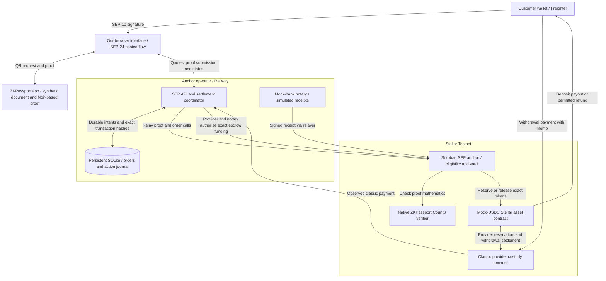
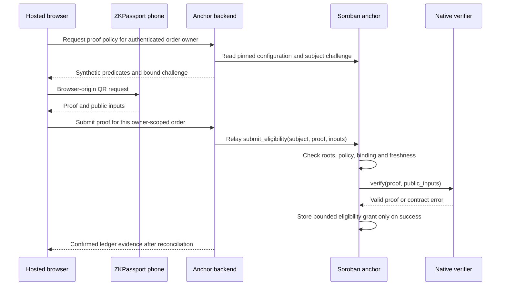

# TR Anchor + ZKPassport: architecture and co-hacker handoff

Reviewed 20 September 2026 against application revision `f1347f4`, since merged
into `main` at `fc66d28`. Continue development on `main`. This describes the current public Count8 SEP anchor,
not the earlier localhost `/anchor-gate` prototype. Evidence and acceptance
status are a dated snapshot, not a promise of future availability.

## Start here

We extended Kaan's mock TRY/USDC anchor with private document predicates,
native ZKPassport proof verification on Soroban, and contract-controlled
settlement. SEP-24 hosts the phone-proof interaction; standard wallet payments
remain the withdrawal entry point.

- [Live Testnet demo](https://tr-anchor-zkpassport.up.railway.app/anchor)
- [Working branch](https://github.com/0x471/tr-mock-anchor/tree/main)
- [Deployment pins and evidence](SEP_ANCHOR_DEPLOYMENT.md)
- [Release review and remaining acceptance](SEP_ANCHOR_REVIEW.md)

Only synthetic developer-mode documents, simulated TRY and self-issued mock
USDC are supported. Do not send real money, enter a real IBAN, or scan a real
identity document for this demo. A token named USDC is identified by its issuer;
our demo asset is not redeemable Circle USDC.

The target user is an anchor customer proving eligibility without sending raw
document attributes to the anchor. The intended product benefit is an eligibility
decision independently enforced by the settlement contract, with familiar
anchor discovery, login, quote and transfer interfaces. Production suitability
and customer adoption are not established by this demo.

## 1. What is inherited and what we added

The fork starts at Kaan's upstream commit
`81eef8af29fa8fdc6f6596a4472c8bedb5381668`.

| Area              | Upstream foundation                            | This fork's current addition or change                                                                           |
| ----------------- | ---------------------------------------------- | ---------------------------------------------------------------------------------------------------------------- |
| Anchor protocols  | SEP-1, SEP-10, SEP-6, SEP-12 and SEP-38        | Native-gated SEP orchestration, SEP-24 hosted onboarding and a restricted programmatic SEP-6 profile             |
| Eligibility       | Simulated SEP-12 customer approval             | Native proof-backed, expiring eligibility; a customer-information update alone cannot approve the native flow    |
| Cryptography      | No native ZKPassport verifier                  | Modified Rust/Soroban BB5 verifier with pinned ZKPassport Count8 verification key                                |
| Settlement        | Backend-coordinated Testnet treasury transfers | Separate Soroban order/vault contract with exact terms, receipts, payout authorization and recovery rules        |
| Withdrawal intake | Ordinary Stellar payment observed by memo      | Same payment model, followed by operator-attested attribution and an exact provider-to-vault transfer            |
| Proof UX          | No ZKPassport hosted flow                      | Browser-origin QR session, synthetic phone proof, native confirmation and reusable eligibility                   |
| Reliability       | Anchor database, ledger and workers            | Separate native-action journal, persisted hashes/envelopes, reconciliation and explicit unknown-outcome handling |
| Demo operations   | Upstream application and deployment            | Our Railway deployment, dedicated Testnet contracts/asset, wallet setup, explorer evidence and Node/Rust/Wasm CI |

We did not author ZKPassport's Noir circuits or invent UltraHonk. The verifier
started from Nethermind's Soroban implementation and was adapted for the pinned
ZKPassport BB5 format, with reference checks against the published verifier.
Attribution, licenses and modifications are in the
[verifier notice](../contracts/zkpassport-verifier/NOTICE.md).

## 2. Architecture and trust boundaries



The provider and notary are distinct signing roles, but both are controlled by
the demo operator. They are not independent decentralized parties.

The backend remains responsible for authentication, admission, quote issuance,
classic-payment observation, relaying, simulated banking and status delivery.
The contracts enforce the pinned proof/policy and vault transition rules.
The verifier alone does not approve customers or release assets.

### Code map

| Component               | Main entry points                                                           | Responsibility                                                               |
| ----------------------- | --------------------------------------------------------------------------- | ---------------------------------------------------------------------------- |
| Hosted interface        | [web/sep-anchor.ts](../web/sep-anchor.ts), [HTML](../web/sep-anchor.html)   | Freighter login, quotes, QR, explicit actions and explorer status            |
| Native SEP HTTP surface | [src/routes/sep-anchor.ts](../src/routes/sep-anchor.ts)                     | SEP-24, native SEP-6/SEP-12, sessions and owner-scoped access                |
| Coordinator             | [src/sep-anchor.ts](../src/sep-anchor.ts)                                   | Exact terms, admission, workflow transitions and reconciliation              |
| Durable storage         | [src/sep-anchor-storage.ts](../src/sep-anchor-storage.ts)                   | Intents, signed actions, bank events and observed payment records            |
| Chain gateway           | [src/sep-anchor-rpc.ts](../src/sep-anchor-rpc.ts)                           | Contract reads, transaction preparation, signing, submission and lookup      |
| Payment observer        | [src/sep-anchor-ingress.ts](../src/sep-anchor-ingress.ts)                   | Testnet network, issuer, receiving-capacity and Horizon payment checks       |
| Firm quotes             | [src/sep-quotes.ts](../src/sep-quotes.ts)                                   | Native-flow quote amounts, fees, limits and expiry                           |
| Native policy           | [contracts/anchor-policy/src/lib.rs](../contracts/anchor-policy/src/lib.rs) | Shared public-input interpretation, commitments and verifier identity checks |
| Eligibility and vault   | [contracts/sep-anchor/src/lib.rs](../contracts/sep-anchor/src/lib.rs)       | Grants, immutable order terms, escrow, receipts, settlement and refunds      |
| Mathematical verifier   | [contracts/zkpassport-verifier](../contracts/zkpassport-verifier/README.md) | Exact supported proof decoding and cryptographic verification                |
| Address precheck        | [src/ofac-precheck.ts](../src/ofac-precheck.ts)                             | Separate backend check against official listed digital-currency addresses    |

The old `src/routes/sep6.ts`, `src/routes/sep12.ts` and `/anchor-gate` are not
the current public native SEP implementation. Do not use old prototype
contracts, profiles or transaction links as evidence for the current flow.

## 3. Proof generation, verification and authorization

### What runs where

- ZKPassport generates the Noir-based proof on the phone. We configure the
  request; we do not deploy a Noir circuit to Soroban.
- Our verifier is Rust compiled to Soroban Wasm. It supports pinned formats,
  not arbitrary Noir proofs or arbitrary future ZKPassport app versions.
- The public deployment uses ZKPassport circuit package 0.20.0 `OuterCount8`:
  10,240 proof bytes, 13 external 32-byte inputs and log N 23.
- The browser SDK is separately pinned to `@zkpassport/sdk` 0.17.1. SDK and
  proof/circuit versions are different identifiers; do not interchange them.
- Verification includes strict encodings, transcript/sumcheck/opening checks,
  the outer pairing equation and the deferred recursive pairing equation.
  Neither pairing obligation is omitted.



The policy currently requires age >=18, nationality ZKR, document issuer ZKR,
synthetic mode and strict non-membership against the pinned sanctions snapshot.
Nationality and document issuer do not establish residence.

The challenge binds the subject to the network, anchor contract and policy;
the policy also pins the domain, scope, roots and verifier identity. A grant
expires at the earlier of the original proof timestamp plus one hour and the
immutable policy expiry. An older proof cannot extend a newer grant.

Anyone can relay a valid subject proof. The contract call does not itself
prove wallet-key ownership or authorize debiting the customer's wallet.
SEP-10 supplies the offchain ownership/admission boundary. Withdrawal payment
signing remains a separate, explicit wallet action.

The grant is wallet/policy-bound and reusable. It is not freshly bound to each
order's amount. Each order separately binds its subject, recipient, refund
destination, direction, quote hash, amounts, bank-destination hash, nonce and
deadline. Settlement checks that order against its subject's eligibility.

### Two different sanctions checks

1. The ZKPassport proof includes a private sanctions-list non-membership
   predicate. The contract pins its root and strictness. The deployed combined
   US/UK/EU/Swiss snapshot is from January 2026, with exact normalized matching.
2. A separate backend precheck compares the connected wallet with officially
   listed digital-currency addresses. This is neither private name screening
   nor an onchain constraint on every transfer of the asset.

Neither is a claim of complete, current production sanctions compliance.

## 4. User and money flows

### Shared entry

1. Read SEP-1 discovery and verify Stellar Testnet and the exact asset issuer.
2. Sign the SEP-10 challenge. The signature authenticates login, not a payment.
3. Create a SEP-24 hosted transaction and exchange its short-lived bootstrap
   credential for an order-scoped session. Do not share bootstrap URLs.
4. Review a SEP-38 firm quote and accept its exact terms. The native limits are
   10 mock USDC and 500 simulated TRY; quotes must also fit policy expiry.
5. Use the existing current eligibility grant or complete the synthetic phone
   proof. A phone success callback is not an onchain confirmation.

### Deposit: simulated TRY to mock USDC

1. The coordinator creates the immutable onchain order. Creation reserves the
   provider's exact tokens in the vault; reservation alone is not eligibility
   or a customer payout.
2. The hosted flow requires current eligibility and a ready receiving wallet
   before offering the simulated bank action.
3. The mock-bank notary records one receipt matching the exact order terms.
4. `settle` requires the escrow, exact receipt and current eligibility within
   the deposit deadline, then transfers the quoted tokens to the fixed user.
5. Display completion only after confirmed chain state. Open the evidence
   links and check the issuer-specific token balance.

The backend can interleave proof and order reconciliation. This is a logical
flow, not a guarantee that every proof transaction precedes order creation.

### Withdrawal: mock USDC to simulated TRY

1. Accept the quote with a made-up `demo:` destination. Do not enter an IBAN.
2. After readiness checks, receive the provider account, exact amount and memo.
3. Sign one ordinary Stellar payment. No custom vault-call signature is
   required from the customer for this payment path.
4. The observer matches the successful payment. Provider and notary authorize
   `fund_withdrawal`, which moves the exact tokens from provider custody into
   the vault and consumes the attributed operation identifier.
5. Explicitly request simulated payout. `authorize_payout` requires current
   eligibility, valid order and escrow. This creates a durable bank obligation.
6. Record the exact paid receipt, then settle escrow to the provider. Once
   payout is authorized, receipt/settlement reconciliation can complete after
   eligibility expiry without authorizing a second payout.

The contract verifies the provider-to-vault transfer. It trusts the operators'
attribution of the earlier classic payment; it does not verify historical
Horizon records, the customer's memo or real fiat delivery onchain.

### Recovery rules

- A lost HTTP response or a timeout means unknown outcome, not failed payment.
  Reconcile the saved transaction hash and the same order before retrying.
- Native actions persist prepared/signed envelopes and hashes before submission.
  Do not create replacement transactions to escape uncertainty.
- Matching quote acceptance is idempotent for the same owner, order, quote and
  bank destination. Different accepted terms conflict; this is not permission
  for blanket automatic POST retries.
- Quote consumption and immutable accepted terms commit together in SQLite.
  Native order creation is a separate journaled and reconciled transaction;
  HTTP, the database and the blockchain are not one atomic operation.
- Before payout authorization, withdrawal escrow can be refunded to its fixed
  owner, including after eligibility expiry, with provider/notary authorization.
- A deposit reservation can be cancelled only before its bank receipt. This
  returns provider tokens; it is not a fiat refund.
- An expired deposit with a bank receipt has no automatic refund path. It needs
  operator recovery. Extra, mismatched or late payments are not silently repriced.

## 5. Protocol and privacy boundaries

| Interface | Current supported role                                                                                |
| --------- | ----------------------------------------------------------------------------------------------------- |
| SEP-1     | Discover endpoints, signing key, network and asset                                                    |
| SEP-10    | Authenticate the supported customer's wallet                                                          |
| SEP-38    | Fix exchange amounts, fees, limits and quote expiry                                                   |
| SEP-24    | Hosted first-time proof onboarding, exchange, status and owned-order resume                           |
| SEP-6     | Programmatic exchange for admitted, self-custodial classic G accounts with current native eligibility |
| SEP-12    | Native customer status; a PUT alone cannot establish verified eligibility                             |

Muxed accounts, shared omnibus identities, contract wallets and different
recipient/refund accounts are outside the current profile. Existing SDK support
for such accounts does not make them supported by this deployment. Completion
through an unmodified third-party wallet's own SEP UI remains unverified.

Document witnesses are not collected as raw passport fields by the anchor UI.
The chosen predicates, wallet, amounts, order identifiers, proof transaction
and public inputs are not secret. Relaying exposes proof material to the
backend and RPC; signed proof-bearing envelopes may be retained in recovery
journals. Do not describe the system as storing no sensitive proof material or
providing unlinkable transactions. Never commit journals, raw proof exports,
private keys, session credentials or personal documents.

The gate controls assets held by this vault, not every transfer or issuance of
the mock asset. The provider controls classic intake before escrow. Issuer
powers and operator custody still exist. Neither the contracts nor this fork
have an independent security audit.

## 6. Deployment and evidence snapshot

| Public component       | Testnet address                                            |
| ---------------------- | ---------------------------------------------------------- |
| SEP anchor contract    | `CA4SZYDLN5Q2QUG6ZPVWCECSSFJPTRCQTL64VNTXOVTZNTVCCQIK2VRM` |
| Count8 verifier        | `CAXZT4KA4KDP4A2ERRMYEUBQE53XZ67NHXICO4AXNTAKJCXDKGFGCJ4H` |
| Mock USDC issuer       | `GDQYN2SNSRQCGBJYB7SQFQIKKKN4YWZCHYZQ5W7UKAB6P36MSIKCVKQN` |
| Stellar asset contract | `CDC35FLF2CZWYA2EFBMW4GCCL2BBYZZGXRZGLJLEAE5UR4CIDUA44OXE` |

Use the [deployment document](SEP_ANCHOR_DEPLOYMENT.md) for Wasm hashes, VK,
operator public keys and full transaction evidence. Do not copy old localhost
addresses into the public deployment.

The immutable policy expires on **21 September 2026 at 01:54:22 Istanbul**
(`2026-09-20T22:54:22Z`). Restarting Railway does not renew it. A future policy
or domain requires a reviewed deployment; existing orders are not migrated
automatically.

### Confirmed

- Fresh public Count8 phone proof: [eligibility transaction](https://stellar.expert/explorer/testnet/tx/08c7c414b6782886f55443c7179a2077f069561e0f5690519d8e22403a1e816e), ledger 4772528.
- First public deposit: [settlement](https://stellar.expert/explorer/testnet/tx/14d7463f6cf8b176ca3f9d6d2ccd10c51e2c4fc8ecd58472fce96d2f4c2553f1), ledger 4772533. Exact 100.00 simulated TRY to 2.0947892 mock USDC; token events and balance increase checked.
- Second public deposit: [creation](https://stellar.expert/explorer/testnet/tx/09f9720b7bc73e5d62c8550f77ffcb09a5576ed276bdabf1cd290af4c374340e), [receipt](https://stellar.expert/explorer/testnet/tx/557e9d617d452137e92a57d3f4a2dc7902acbdb057ff8dbca73566e3bc52db3b), and [settlement](https://stellar.expert/explorer/testnet/tx/fd1b82745299a8955e225bb32ff8c6887f46973a4944f7a7b7557031b350daa4) returned RPC `SUCCESS` at ledgers 4772819, 4772823 and 4772824. This reused eligibility; it is not a second fresh phone-proof result.
- At `f1347f4`: 423 application tests, both typechecks and the production build passed. [CI](https://github.com/0x471/tr-mock-anchor/actions/runs/35496032868) also passed native and compiled-Wasm checks.
- Railway reported revision `f1347f4` successfully deployed at 10:11 Istanbul
  on 20 September. That release includes exact quote-acceptance warning
  reconciliation; it does not establish the cause of every network interruption.

The first proof's grant expires at **10:35:47 Istanbul on 20 September**.
Read current eligibility before a live presentation; refresh the synthetic
proof when needed. Do not alter the order's terms to refresh eligibility.

### Still to verify

- A complete public withdrawal through the hosted UI and Freighter.
- Completed exchanges through an unmodified target wallet's own SEP interface.
- Judge access from a separately admitted wallet. Public HTTPS does not mean
  arbitrary wallets are admitted to this controlled demo.

Native policy/lifecycle unit tests stub the external verifier in some cases.
Those are not fresh cryptographic phone-proof evidence. Earlier Count5/Count7
tests and flows remain separate. The historical conformance-suite results
and their pre-cap fixture limitations are recorded in the release review.

## 7. Co-hacker setup and safe collaboration

```sh
git clone --branch main https://github.com/0x471/tr-mock-anchor.git
cd tr-mock-anchor
npm ci
pnpm hooks:install
npm run typecheck
npm test
npm run build
```

Use Node.js 24 and the committed npm lockfile; do not add a pnpm lockfile.
Contract toolchains and reproduction commands are in the respective contract
READMEs and [CI workflow](../.github/workflows/zkpassport.yml).

Do not use the existing `npm run sep:conformance` or `npm run e2e:sep6`
unchanged as proof of this deployment. They retain upstream/legacy defaults;
the native public-profile checks and their limitations are documented in the
release review.

These commands validate/build code; they do not provision a second public
anchor. Request a dedicated demo configuration privately before running live
workers. Never copy operator secrets, a production database or signing journals
into a new process. Deployment/liquidity scripts have explicit execution gates;
do not run their write mode just to inspect configuration.

The public service uses one Railway replica and persistent SQLite at
`/data/anchor.db`. Legacy economic workers are disabled; the native SEP loop
continues reconciliation. Preserve the volume and journals. Do not enable
legacy mode, increase replicas or redeploy contracts as a quick debugging fix.
`/health` proves liveness, not successful proof verification or settlement.

Coordinate changes on the working branch, keep commits title-only and
conventional under 70 characters, use ASCII documentation, and run installed
hooks. Do not commit `CLAUDE.md`, `.claude`, secrets or private evidence.

## 8. Scale-track demo and remaining work

The immediate goal is a reproducible demonstration, not more features.

1. Finish the public withdrawal acceptance with 1 mock USDC and a made-up
   `demo:` destination. Record the customer payment, escrow, authorization,
   receipt and settlement evidence. Do not call it done while any hash is pending.
2. Verify the exact deployed release, reconnect/recovery behavior and judge
   wallet admission. Never share an operator or customer private key for access.
3. Record a short backup of the actual successful flow. A video is a reliability
   recommendation here, not a confirmed organizer requirement.
4. Prepare the official-template pitch and submission: Scale selection, team
   details, correct branch URL, live app, contract evidence, this Mermaid
   architecture and the proposed roadmap below. Obtain the actual template
   and portal links from organizers; they were missing from the saved handbook.
5. Cite only the specific Stellar skill files actually used and verified from
   development records. Do not invent a usage list. Keep upstream attribution.
6. Submit before the user-confirmed noon Istanbul deadline, with upload buffer.
   Do not submit the obsolete parent-directory Shopier plan as this project.

Suggested demonstration: explain the problem, show the synthetic phone proof,
open its native verification receipt, show deposit settlement, demonstrate
withdrawal once accepted, and state the custody/simulated-bank limitations.
If no fresh proof is generated live, clearly label the displayed proof as a
previously confirmed receipt rather than implying a fresh verification.

### Proposed post-hackathon roadmap

| Stage                            | Work                                                                                                                                       | Exit evidence                                                                 |
| -------------------------------- | ------------------------------------------------------------------------------------------------------------------------------------------ | ----------------------------------------------------------------------------- |
| Interoperability and reliability | Complete supported-wallet positive/negative cases, concurrency/restart recovery, operator tooling and monitoring                           | Reproducible end-to-end deposits, withdrawals and recovery in target wallets  |
| Verifier and policy hardening    | Independent cryptographic/security review, more matching proof fixtures, resource benchmarks, root-update and policy-migration design      | Reviewed threat model, audit findings addressed and pinned regression corpus  |
| Real-provider pilot              | Partner with an appropriate anchor, replace mock receipts with an approved bank integration, define privacy/retention and custody controls | Agreed operating model and a separately authorized, reviewed pilot            |
| Ecosystem continuation           | Package a documented integration, collect actual user/anchor feedback, assess SCF or InstAward fit                                         | Credible proposal and measured feedback, not an asserted grant or partnership |

These are proposed next steps. No audit, mainnet launch, bank partnership,
funding award, production compliance status or external traction is claimed.

## 9. Further reading

- [Current deployment and acceptance checklist](SEP_ANCHOR_DEPLOYMENT.md)
- [Release review and dependency-audit boundary](SEP_ANCHOR_REVIEW.md)
- [SEP design research and implementation addendum](SEP_ZKPASSPORT_INTEROPERABILITY.md) - its baseline-gap section is historical, not current deployment status.
- [Vault and eligibility contract](../contracts/sep-anchor/README.md)
- [Verifier formats and mathematical checks](../contracts/zkpassport-verifier/README.md) - distinguish the default historical Count5 fixture from the public Count8 profile.
- [Synthetic document setup](SYNTHETIC_DOCUMENT_SETUP.md)
- [Private sanctions research and snapshot limits](ZKPASSPORT_SANCTIONS_RESEARCH.md)
- [Backend OFAC address precheck](OFAC_PRECHECK_RESEARCH.md)
- [Domain terminology](../CONTEXT.md) and [contribution rules](../CONTRIBUTING.md)
